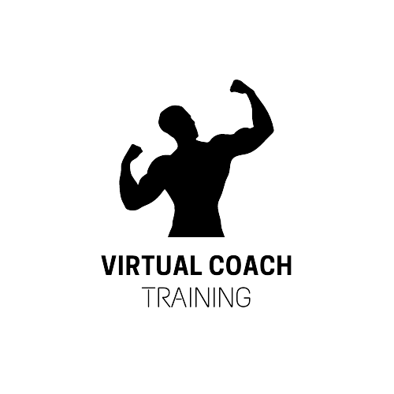

# gymWPedro ☑️

**Description:** 🫡
This is a project aimed at assisting individuals with their gym routines. It will be regularly updated to provide support for various other aspects crucial to the gym experience, including nutrition, motivation tips, and more.

**Features:**
📰
- The project starts with a single person who wants to track their gym routines on a website for more precise monitoring.

**Features (Future Plans):**
🔮
- Implementation of dynamic features to enhance the user experience.
- User registration with personalized usernames, allowing everyone to save their weight, repetitions, and personal records (PRs).
- Regular updates for sharing goals, progress tracking, and more.

**How to Use:**
🔎

For now, it's a straightforward web application with the following functionality:

1. Visit the website.
2. Choose one of our available gym routines.
3. Begin tracking your progress on the chosen routine.

In its current state, the website allows users to select and follow predefined gym routines, providing a basic tracking capability.

**Technologies:**
🤓
- The project is currently built using vanilla HTML and CSS.
- It has limited JavaScript functionalities.
- The project is more static in nature and does not include a backend at this time.

**Collaborators:**
👋
- Currently, the project has only one collaborator, which is Inmortalini.
- There are plans to expand and welcome more collaborators in the future to enhance the project's development and features.

**License:**
- The project is licensed under the MIT License.
